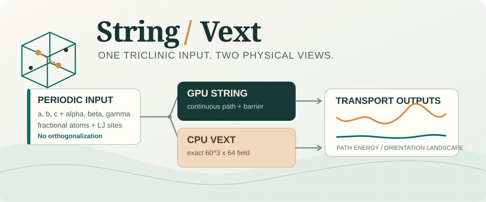

<p align="center"></p>

# String_Vext

**Two complementary calculations for neutral molecular guests in periodic frameworks.**
GPU String optimizes a diffusion pathway. CPU Vext generates a spatial,
orientation-resolved Lennard-Jones energy landscape. Neither program assumes
that the framework is a COF: the framework is defined by the atoms and cell
provided in `input.dat`.

| Program | Primary result | Hardware | Geometry |
| --- | --- | --- | --- |
| `string-path` | Optimized translational/rotational String path and energy profile | CUDA GPU | Full triclinic periodic cell |
| `string-vext` | Exact 60 x 60 x 60 grid, **64 orientations by default** | CPU | Full triclinic periodic cell |

> [!IMPORTANT]
> This release is **source-available for noncommercial use only** under
> [PolyForm Noncommercial 1.0.0](LICENSE). Commercial use requires separate
> written permission from **qiuyong**, the sole repository author.

## Input contract

Both commands consume the native String `input.dat` format. It contains
`a, b, c`, `alpha, beta, gamma` (degrees), framework **fractional** atom
coordinates and LJ parameters, and guest sites. **Do not orthogonalize the
cell first.** Each program constructs the complete 3 x 3 cell matrix from
the six cell parameters and maps fractional positions to Cartesian space
internally. Neither command accepts a raw CIF directly; a CIF-to-`input.dat`
conversion must preserve the original lengths, angles, atom order, and LJ
assignment.

The current exact Vext CPU kernel supports a neutral guest with **two
identical LJ sites**. The neutral-gas String CUDA repair enumerates all
triclinic images within the cutoff instead of applying a Cartesian-component
minimum-image shortcut. The spatial field is **not** computed by trilinear
interpolation of a coarse site grid; the two guest sites are evaluated at
every requested center and orientation.

## Install and build

Requirements: Linux, Python >=3.9, NumPy, SciPy, a C++17 compiler for CPU
Vext, and an NVIDIA CUDA toolkit with **cuFFT** for GPU String. The included
String binary was built for RTX 4090 (`sm_89`) using GCC 13.1 and NVCC 13.3;
it requires glibc >=2.38. Rebuild it for older Linux systems or other GPU
architectures. The prebuilt Vext shared library is
included, but rebuilding is recommended on a new platform.

```bash
python -m pip install -e .
bash scripts/build_vext.sh
NVCC=/usr/local/cuda-13.3/bin/nvcc CXX=/opt/gcc/13.1.0/bin/g++ \
  CUDA_ARCH=sm_89 bash scripts/build_string.sh
```

On the original HPC cluster, load the GCC/CUDA modules before building.
The Vext build script uses `-nostdlib` because some CPU nodes lack glibc
development files; the kernel only uses basic arithmetic/compiler builtins.
See `native/string/source_code/` and `native/vext/kernel.cpp` for the two
physical kernels. The compiled String binary requires a compatible CUDA
runtime and cuFFT at execution time.

The GitHub Release workflow builds a wheel and tagged source archive from
the included reference binaries. **It does not recompile CUDA String or run
GPU tests on GitHub.** Native recompilation still needs the toolchain above;
other GPU architectures need a matching `CUDA_ARCH`.

## Run

```bash
string-vext --input input.dat --output results/vext.npz \
  --size 60 --orientations 64 --kernel build/vext_kernel.so

string-path --input input.dat --output-dir results/string_a \
  --solver build/string_triclinic_cuda
```

`string-vext` writes a compressed NPZ plus a SHA256/provenance JSON file.
Omit `--kernel` or `--solver` to use the included reference binaries.
Build scripts write to ignored `build/` paths and refuse to overwrite them.
`string-path` writes `string_path.dat`, solver logs, and a provenance JSON;
an optional `--initial` supplies a saved path, and `--diffusivity-bin` runs
the separate native TST utility. Outputs are created exclusively and are
never silently overwritten. Run separate String inputs for a/b/c directions.
The optimized String path is a numerical candidate, **not a proof of the
global minimum barrier**.

## Small examples

- [`examples/toy_triclinic/input.dat`](examples/toy_triclinic/input.dat) is a
  one-atom parser/Vext smoke input, not a physical diffusion benchmark.
- [`tests/cof/examples/c2h4/input.dat`](tests/cof/examples/c2h4/input.dat)
  and [`tests/cof/examples/c2h6/input.dat`](tests/cof/examples/c2h6/input.dat)
  are two small nonorthogonal GPU-pilot inputs with corrected guest LJ
  parameters; both have gamma = 119.993 degrees.

These are the **only three tracked input files**. The 53,688 production
inputs and all CIF, trajectory, Vext, and diffusion datasets are excluded.

## Validation

The COF work is a **test case**, not the software scope. Its scripts, source
snapshot, and small reports live under [`tests/cof/`](tests/cof/). No CIF
dataset, 53,688 batch inputs, String trajectories, or Vext NPZ results are
bundled.

- A synthetic nonorthogonal-cell unit test exercises the public Vext API.
- Fifty COF materials (100 gas fields) were compared over full 60^3 x 64
  fields. The largest low-energy orientation difference after float32
  storage was 0.000122 K; site fields matched exactly.
- On 300 archived String-path geometries reevaluated with the corrected
  guest parameters, the largest capped log10(D) difference was below
  1e-13 dex. For paths with peak energy below 2000 K, raw barrier differences
  were below 7.1e-11 K. Extreme overlap paths can have huge *raw* barriers;
  their absolute floating-point difference must not be confused with an
  accessible-barrier error.
- Two complete input-to-NPZ comparisons were 25.3x and 23.1x faster than
  the original CPU DIRECT implementation. These are sample timings, not a
  guarantee for every structure or parallel filesystem.
- The corrected BODY-X GPU String pilot passed six 401-point paths, each
  independently replayed on CPU (largest absolute difference 6.59e-10 K).
  The full six-GPU batch is queued separately; a passed pilot is **not** a
  completed dataset.

Run the portable tests with `PYTHONPATH=src python -m unittest discover -s
tests/unit -v`. The cohort-specific reference scripts in `tests/cof/` use
absolute paths from the original HPC project and are included for audit,
not as a standalone dataset.

## Repository map

```text
src/string_vext/    material-independent Python input, String, and Vext APIs
native/string/      repaired triclinic CUDA String source and reference binary
native/vext/        exact CPU neighbor-reuse source and shared library
scripts/            portable build commands
tests/unit/         synthetic, data-free nonorthogonal tests
tests/cof/          COF-only validation reports and original batch snapshot
examples/           one small synthetic triclinic input
```

Author and maintainer: **qiuyong**. See [NOTICE](NOTICE) and [LICENSE](LICENSE).
